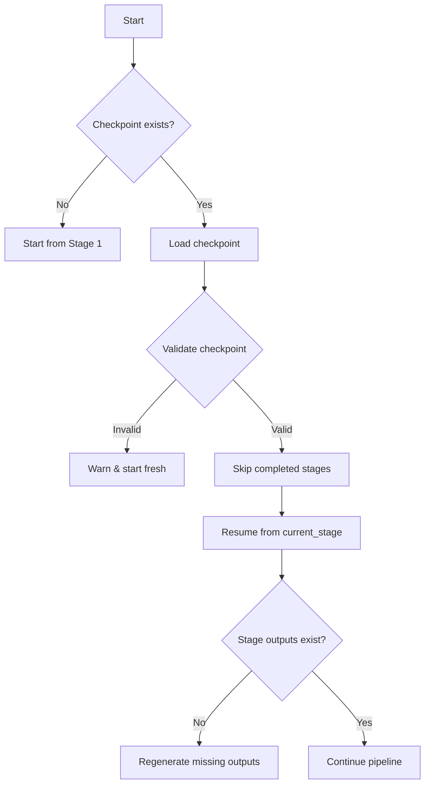

# Knowledge Harvester Checkpoint Format

## Overview

The checkpoint system enables the Knowledge Harvester to resume interrupted harvesting sessions, preserving progress across the six-stage pipeline. Checkpoints are automatically created after each stage completion and can be manually manipulated for debugging or recovery.

## File Location and Naming

### Default Location
```text
~/.claude/harvests/<harvest_id>/checkpoint.json
```

### Alternative Locations
- Working directory: `./.harvest-checkpoint.json`
- Custom path via `--checkpoint-dir` flag
- Temporary directory: `/tmp/harvest-<harvest_id>/checkpoint.json`

### Naming Convention
- Primary: `checkpoint.json`
- With timestamp: `checkpoint-<YYYYMMDD-HHMMSS>.json`
- Stage-specific: `checkpoint-stage<N>.json` (for debugging)

## Checkpoint Lifecycle

### Creation Triggers

Checkpoints are written automatically:

1. **After Stage Completion**
   - Stage 1 (Enumerate) → checkpoint with file list
   - Stage 2 (Triage) → checkpoint with filtered files
   - Stage 3 (Harvest) → checkpoint with raw content
   - Stage 4 (Extract) → checkpoint with extracted knowledge
   - Stage 5 (Synthesize) → checkpoint with final output

2. **On Interruption**
   - SIGINT (Ctrl+C) → graceful checkpoint save
   - SIGTERM → emergency checkpoint write
   - Error conditions → partial checkpoint with error state

3. **Manual Triggers**
   - `--checkpoint-now` flag during execution
   - `/checkpoint` command in interactive mode

### Checkpoint Content

```json
{
  "version": "1.0",
  "harvest_id": "550e8400-e29b-41d4-a716-446655440000",
  "created_at": "2024-02-27T10:30:00Z",
  "updated_at": "2024-02-27T10:45:00Z",
  "current_stage": 3,
  "stage_outputs": {
    "enumerate": "~/.claude/harvests/550e8400/stage1-enumeration.json",
    "triage": "~/.claude/harvests/550e8400/stage2-triage.json",
    "harvest": "~/.claude/harvests/550e8400/stage3-content.json"
  },
  "progress": {
    "completed": 45,
    "total": 120,
    "percentage": 37.5
  },
  "errors": [],
  "metadata": {
    "source_directory": "/path/to/project",
    "config_file": "harvest.config.json",
    "filters": {
      "extensions": [".py", ".js", ".md"],
      "max_size_mb": 10
    }
  },
  "stage_history": [
    {
      "stage": 1,
      "started_at": "2024-02-27T10:30:00Z",
      "completed_at": "2024-02-27T10:32:00Z",
      "status": "completed"
    },
    {
      "stage": 2,
      "started_at": "2024-02-27T10:32:00Z",
      "completed_at": "2024-02-27T10:35:00Z",
      "status": "completed"
    },
    {
      "stage": 3,
      "started_at": "2024-02-27T10:35:00Z",
      "status": "in_progress"
    }
  ]
}
```

## Resume Behavior

### Automatic Detection

The harvester checks for checkpoints in this order:

1. Explicit path via `--resume <checkpoint_file>`
2. Working directory `./.harvest-checkpoint.json`
3. Last harvest in `~/.claude/harvests/*/checkpoint.json` (sorted by modification time)
4. Environment variable `HARVEST_CHECKPOINT`

### Resume Process



### Stage Skipping Rules

1. **Completed stages** (status: "completed") are skipped entirely
2. **In-progress stages** resume from last progress point
3. **Failed stages** retry from beginning with error context
4. **Missing output files** trigger stage re-execution

### Validation Checks

Before resuming, the system validates:

- Checkpoint schema version compatibility
- Output file existence and accessibility
- Source directory hasn't changed significantly
- Configuration compatibility
- No corruption in checkpoint file

## Manual Checkpoint Manipulation

### Viewing Checkpoints

```bash
# Pretty-print checkpoint
jq . checkpoint.json

# Check stage status
jq '.stage_history[] | select(.stage == 3)' checkpoint.json

# View errors
jq '.errors[]' checkpoint.json
```

### Modifying Checkpoints

```bash
# Reset to specific stage
jq '.current_stage = 2' checkpoint.json > checkpoint.tmp && mv checkpoint.tmp checkpoint.json

# Clear errors
jq '.errors = []' checkpoint.json > checkpoint.tmp && mv checkpoint.tmp checkpoint.json

# Update progress
jq '.progress.completed = 0' checkpoint.json > checkpoint.tmp && mv checkpoint.tmp checkpoint.json
```

### Recovery Scenarios

#### Scenario 1: Corrupted Output File
```bash
# Remove corrupted output reference
jq 'del(.stage_outputs.harvest)' checkpoint.json > checkpoint.tmp
mv checkpoint.tmp checkpoint.json
# Harvester will regenerate on resume
```

#### Scenario 2: Force Re-run Stage
```bash
# Set stage to re-run
jq '.current_stage = 2 | del(.stage_outputs.triage)' checkpoint.json > checkpoint.tmp
mv checkpoint.tmp checkpoint.json
```

#### Scenario 3: Continue After Error
```bash
# Clear error state and increment progress
jq '.errors = [] | .progress.completed += 1' checkpoint.json > checkpoint.tmp
mv checkpoint.tmp checkpoint.json
```

## Best Practices

### For Users

1. **Keep checkpoints** until harvest is confirmed successful
2. **Don't modify** checkpoint files during active harvest
3. **Use --checkpoint-dir** for important harvests to preserve history
4. **Review errors** before resuming failed harvests

### For Developers

1. **Atomic writes** - Use temporary file + rename pattern
2. **Validate before resume** - Don't trust checkpoint blindly
3. **Preserve backward compatibility** - Check version field
4. **Log checkpoint operations** - Aid debugging
5. **Handle missing outputs gracefully** - Regenerate if needed

## Error Handling

### Checkpoint Write Failures

If checkpoint write fails:
1. Attempt write to alternate location (`/tmp`)
2. Log error with full details
3. Continue harvest but warn about no resume capability
4. Exit with special code (75) indicating checkpoint failure

### Checkpoint Read Failures

If checkpoint read fails:
1. Log corruption details
2. Offer to start fresh or abort
3. Preserve corrupted checkpoint with `.corrupt` suffix
4. Create new checkpoint if proceeding

## Command-Line Interface

### Resume Commands

```bash
# Auto-detect and resume
harvest --resume

# Resume specific checkpoint
harvest --resume ~/.claude/harvests/abc123/checkpoint.json

# Resume with different config
harvest --resume checkpoint.json --config new-config.json

# Force fresh start (ignore checkpoints)
harvest --fresh --no-checkpoint
```

### Checkpoint Management

```bash
# List all checkpoints
harvest --list-checkpoints

# Validate checkpoint
harvest --validate-checkpoint checkpoint.json

# Clean old checkpoints
harvest --clean-checkpoints --older-than 7d

# Export checkpoint info
harvest --checkpoint-info checkpoint.json
```

## Integration with Stages

### Stage 1: Enumerate
- Saves: File list, patterns matched, scan statistics
- Resume: Skips file scanning, uses saved list

### Stage 2: Triage
- Saves: Filtered file list, exclusion reasons
- Resume: Skips filtering, uses saved selections

### Stage 3: Harvest
- Saves: Raw content cache, read progress
- Resume: Continues from last read file

### Stage 4: Extract
- Saves: Extracted knowledge items, processing queue
- Resume: Processes remaining items in queue

### Stage 5: Synthesize
- Saves: Partial synthesis, combination progress
- Resume: Continues synthesis from checkpoint

### Stage 6: Complete
- Saves: Final outputs, summary statistics
- Resume: Not applicable (terminal stage)

## Schema Versioning

### Current Version: 1.0

Future versions may add:
- Distributed checkpoint coordination
- Incremental progress within files
- Parallel stage execution tracking
- Cloud checkpoint storage

### Migration Strategy

When schema version changes:
1. Attempt automatic migration
2. Preserve original with `.v<old>` suffix
3. Log migration details
4. Validate migrated checkpoint

## Performance Considerations

### Checkpoint Size

- Typical: 1-10 KB (metadata only)
- Large harvests: Up to 1 MB (with file lists)
- Compression: Gzip for checkpoints > 100 KB

### Write Frequency

- Default: After each stage
- Configurable: `--checkpoint-interval <seconds>`
- Progress checkpoints: Every 100 files or 5 minutes

### I/O Impact

- Asynchronous writes when possible
- Buffered progress updates
- Debounced checkpoint updates (min 1 second between writes)
