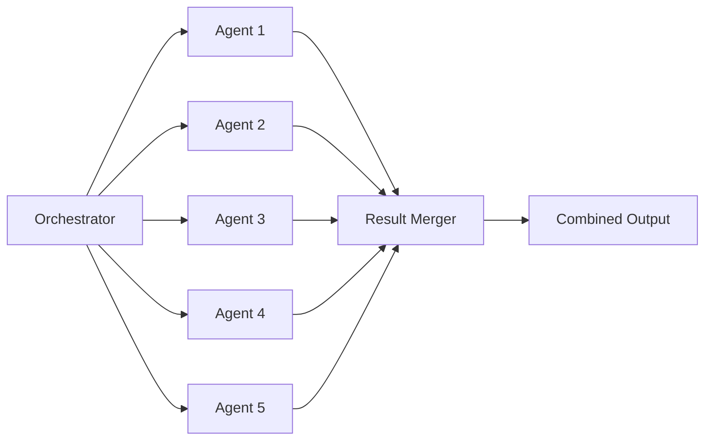

# Concurrency Patterns for Knowledge Harvester

## Overview

This document defines standardized patterns for concurrent execution across all knowledge harvester stages. These patterns optimize for throughput while avoiding rate limits and maintaining result quality.

## Core Patterns

### 1. Batching Pattern

**Recommended batch sizes by stage:**

| Stage | Batch Size | Rationale |
|-------|------------|-----------|
| **Triage** | 5-10 candidates | Balance between parallelism and rate limiting |
| **Harvest** | 3-5 sources | Network I/O bound, avoid overwhelming APIs |
| **Extract** | 5 sources | CPU intensive, prevents memory saturation |
| **Synthesize** | Sequential | Single agent to maintain coherent synthesis |

**Implementation example:**
```python
# Pseudo-code for batch processing
def process_in_batches(items, batch_size=5):
    for i in range(0, len(items), batch_size):
        batch = items[i:i+batch_size]
        results = await parallel_dispatch(batch)
        yield from results

        # Optional: checkpoint between batches
        if i + batch_size < len(items):
            checkpoint_progress(i + batch_size)
```

### 2. Parallel Agent Limits

**Maximum concurrent agents:** 3-5

**Rationale:**
- API rate limits typically allow 3-5 concurrent requests
- Memory usage scales linearly with agent count
- Diminishing returns beyond 5 parallel agents

**Dynamic scaling based on workload:**
```text
if num_items < 10:
    max_parallel = 3
elif num_items < 50:
    max_parallel = 5
else:
    max_parallel = 5  # Never exceed 5
```

### 3. Fan-Out/Fan-In Pattern



**Key considerations:**
- **Fan-out:** Dispatch work to parallel agents
- **Fan-in:** Collect and merge results
- **Ordering:** Preserve input order in output
- **Timeout:** Set per-batch timeout (2x expected single agent time)

## Result Merging Strategies

### 1. Ordered Merge (Default)

Maintains the original input order regardless of completion order:

```python
# Pseudo-code
results = [None] * len(batch)
for idx, future in enumerate(futures):
    results[idx] = await future
return [r for r in results if r is not None]
```

### 2. First-Come-First-Served

For time-sensitive operations where order doesn't matter:

```python
# Pseudo-code
results = []
for future in as_completed(futures):
    result = await future
    results.append(result)
return results
```

### 3. Deduplication

When processing may generate duplicate findings:

```python
# Pseudo-code
seen = set()
unique_results = []
for result in results:
    key = generate_key(result)  # e.g., hash of content
    if key not in seen:
        seen.add(key)
        unique_results.append(result)
return unique_results
```

## Error Handling

### Failure Modes

| Failure Type | Strategy | Example |
|--------------|----------|---------|
| **Single agent fails** | Continue, log warning | 1 of 5 triage agents times out |
| **>30% agents fail** | Abort batch, retry once | 2 of 5 agents fail |
| **>50% agents fail** | Abort operation | Systemic issue detected |
| **Rate limit hit** | Exponential backoff | 429 error from API |

### Error Recovery Flow

```text
1. Try batch with N agents
2. If rate limited:
   - Wait with exponential backoff (1s, 2s, 4s, 8s)
   - Reduce batch size by 50%
   - Retry
3. If agent fails:
   - Log failure with context
   - Continue with remaining agents
   - If >30% fail, abort batch
4. If batch fails:
   - Retry once with reduced parallelism
   - If still fails, mark batch as failed
   - Continue with next batch (unless >50% total failure)
```

## Rate Limiting Considerations

### API Call Budget

**Per-minute limits (typical):**
- Haiku: 100 calls/minute
- Sonnet: 50 calls/minute
- Opus: 20 calls/minute

**Budget allocation by stage:**

| Stage | Model | Parallel Limit | Rationale |
|-------|-------|----------------|-----------|
| Triage | Haiku | 5 agents | High volume, low complexity |
| Extract | Sonnet | 3 agents | Moderate complexity |
| Synthesize | Opus | 1 agent | High complexity, sequential |

### Backoff Strategy

```python
# Exponential backoff with jitter
def calculate_backoff(attempt, base_delay=1.0):
    delay = base_delay * (2 ** attempt)
    jitter = random.uniform(0, delay * 0.1)
    return min(delay + jitter, 60)  # Cap at 60 seconds
```

## Checkpointing

### Between Batches

Save progress after each batch completes:

```json
{
  "stage": "triage",
  "total_items": 100,
  "processed": 40,
  "batch_size": 10,
  "last_batch_completed": 4,
  "timestamp": "2024-02-27T10:30:00Z"
}
```

### Recovery from Checkpoint

```python
# Pseudo-code
def resume_from_checkpoint(checkpoint):
    items = load_all_items()
    start_idx = checkpoint["processed"]
    remaining = items[start_idx:]
    return process_in_batches(remaining, checkpoint["batch_size"])
```

## Stage-Specific Patterns

### Triage Stage (Parallel Scoring)

- **Pattern:** Fan-out per lens, aggregate scores
- **Parallelism:** 5-10 candidates simultaneously
- **Aggregation:** Median/mean across multiple scorers
- **Checkpoint:** After each batch of candidates

### Harvest Stage (Network I/O)

- **Pattern:** Parallel fetch with retry
- **Parallelism:** 3-5 concurrent requests
- **Retry:** 3 attempts with exponential backoff
- **Timeout:** 30 seconds per source

### Extract Stage (CPU Intensive)

- **Pattern:** Batch process with memory limits
- **Parallelism:** 5 sources maximum
- **Memory guard:** Check available memory before dispatch
- **Output:** Stream to JSONL to avoid memory buildup

### Synthesize Stage (Sequential)

- **Pattern:** Single agent, no parallelism
- **Reason:** Maintains coherent narrative
- **Optimization:** Pre-load all extractions into memory
- **Checkpoint:** Not applicable (single operation)

## Examples

### Example 1: Triage with Parallel Scoring

```text
# Input: 20 candidates, 2 lenses, 3 scorers per lens

Batch 1 (candidates 1-10):
  For each candidate:
    Lens A: dispatch 3 parallel scorers → aggregate
    Lens B: dispatch 3 parallel scorers → aggregate
  Total: 60 parallel agent calls

Batch 2 (candidates 11-20):
  [Same pattern]

Result: 20 scored candidates in 2 batches
```

### Example 2: Extract with Checkpointing

```text
# Input: 15 sources to extract

Batch 1 (sources 1-5):
  Parallel dispatch → 5 extractions
  Checkpoint: {"processed": 5}

Batch 2 (sources 6-10):
  Parallel dispatch → 5 extractions
  Checkpoint: {"processed": 10}

Batch 3 (sources 11-15):
  Parallel dispatch → 5 extractions
  Checkpoint: {"processed": 15}

Result: 15 extractions in 3 batches with recovery points
```

## Performance Metrics

Track these metrics to optimize concurrency:

| Metric | Target | Alert Threshold |
|--------|--------|-----------------|
| **Batch completion time** | <30s | >60s |
| **Agent failure rate** | <10% | >30% |
| **Rate limit hits** | <5/hour | >10/hour |
| **Memory usage** | <2GB | >4GB |
| **Total pipeline time** | <5 min | >10 min |

## Best Practices

1. **Start conservative:** Begin with batch_size=3, increase gradually
2. **Monitor rate limits:** Track 429 responses, adjust accordingly
3. **Preserve order:** Users expect results in predictable order
4. **Log extensively:** Every parallel dispatch should be logged
5. **Fail gracefully:** Partial results better than no results
6. **Test at scale:** Simulate 100+ item pipelines in testing
7. **Profile memory:** Parallel agents multiply memory usage
8. **Consider time zones:** API limits may vary by region/time
